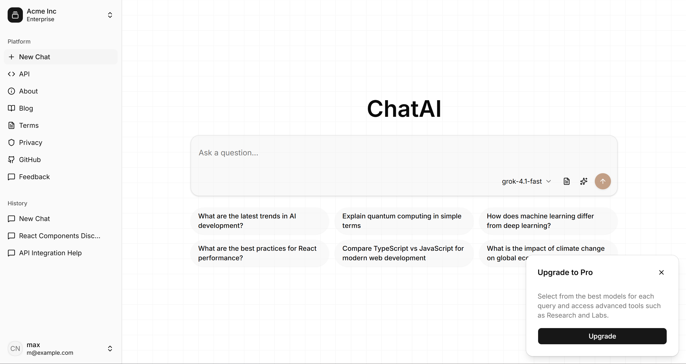

# AI Chat Application

A modern, AI-powered chat application built with Next.js, featuring an intuitive interface for interacting with multiple AI models, real-time spell checking, and a beautiful UI.

**Live Demo**: [https://ai-chat-red-pi.vercel.app/](https://ai-chat-red-pi.vercel.app/)

<div align="center">
  
</div>

## Features

- **AI Chat Interface**: Modern chat interface with user and assistant message bubbles
- **Multiple AI Models**: Choose from Grok 4.1 Fast, Grok 4.1 Deep, or Grok 4.0 models
- **Suggested Questions**: Quick-start prompts to help you get started
- **Real-time Spell Checking**: Built-in spell checker with visual indicators
- **Responsive Design**: Fully responsive interface with collapsible sidebar
- **Modern UI**: Clean design with smooth animations and transitions
- **Message History**: Track your conversation history
- **Model Selection**: Easy switching between different AI models
- **Pro Upgrade Card**: Optional upgrade prompt for advanced features

## Technologies

This project is built with the following technologies:

- **Framework**: [Next.js](https://nextjs.org) 16.1.1 (App Router)
- **UI Library**: React 19.2.3
- **Language**: TypeScript 5
- **Styling**: Tailwind CSS 4
- **UI Components**: [Base UI](https://base-ui.com) / [shadcn/ui](https://ui.shadcn.com)
- **Icons**: [Lucide React](https://lucide.dev) - Beautiful icon library
- **Utilities**: 
  - `class-variance-authority` - Component variants
  - `clsx` & `tailwind-merge` - Class name utilities

## Prerequisites

Before you begin, ensure you have the following installed:

- **Node.js** 18.0 or higher
- **pnpm** 8.0 or higher (recommended package manager)

If you don't have pnpm installed, you can install it globally:

```bash
npm install -g pnpm
```

## Installation

1. **Clone the repository** (if applicable) or navigate to the project directory:

```bash
cd templates/base-ui/ai-chat
```

2. **Install dependencies**:

```bash
pnpm install
```

3. **Start the development server**:

```bash
pnpm dev
```

4. **Open your browser** and navigate to [http://localhost:3000](http://localhost:3000)

The application will automatically reload when you make changes to the code.

## Available Scripts

- `pnpm dev` - Start the development server on [http://localhost:3000](http://localhost:3000)
- `pnpm build` - Create an optimized production build
- `pnpm start` - Start the production server (requires `pnpm build` first)
- `pnpm lint` - Run ESLint to check for code quality issues

## Project Structure

```
ai-chat/
├── app/                    # Next.js App Router directory
│   ├── layout.tsx         # Root layout with theme provider
│   ├── page.tsx           # Main chat page
│   └── globals.css        # Global styles and Tailwind imports
├── components/            # React components
│   ├── ui/               # Reusable UI components (shadcn/ui style)
│   │   ├── button.tsx
│   │   ├── card.tsx
│   │   ├── select.tsx
│   │   ├── tooltip.tsx
│   │   └── ...           # Other UI components
│   └── chat-interface.tsx # Main chat interface component
├── lib/                  # Utility functions
│   └── utils.ts         # Utility functions (cn helper, etc.)
├── public/              # Static assets
│   └── screenshot.png   # Application screenshot
├── components.json      # shadcn/ui configuration
├── package.json        # Dependencies and scripts
├── tsconfig.json       # TypeScript configuration
└── tailwind.config     # Tailwind CSS configuration (via CSS)
```

## Usage

### Starting a Chat

1. Type your question in the input field at the bottom of the screen
2. Select your preferred AI model from the dropdown (Grok 4.1 Fast, Grok 4.1 Deep, or Grok 4.0)
3. Click the send button (arrow up icon) or press Enter to send your message
4. The AI will respond in the chat interface

### Using Suggested Questions

- Click on any of the suggested question buttons to quickly start a conversation
- The question will be automatically filled in the input field
- You can edit the question before sending if needed

### Selecting AI Models

- Use the model selector dropdown in the input toolbar
- Choose between:
  - **Grok 4.1 Fast**: Fast responses, ideal for quick queries
  - **Grok 4.1 Deep**: More thorough responses, better for complex questions
  - **Grok 4.0**: Previous generation model

### Spell Checking

- The application includes real-time spell checking
- Misspelled words are automatically highlighted with a wavy red underline
- Currently highlights words like "mechanical" and "programming" (customizable)

## Customization

### Modifying Available Models

To add, remove, or modify AI models, edit the `SelectContent` in `components/chat-interface.tsx`:

```typescript
<SelectContent>
  <SelectItem value="grok-4.1-fast">Grok 4.1 Fast</SelectItem>
  <SelectItem value="grok-4.1-deep">Grok 4.1 Deep</SelectItem>
  <SelectItem value="grok-4.0">Grok 4.0</SelectItem>
  {/* Add your custom models here */}
</SelectContent>
```

### Customizing Suggested Questions

To modify the suggested questions, edit the `suggestedQuestions` array in `components/chat-interface.tsx`:

```typescript
const suggestedQuestions = [
  "What are the latest trends in AI development?",
  "Explain quantum computing in simple terms",
  // Add your custom questions here
]
```

### Customizing Spell Check Words

To modify the spell check words, edit the `spellCheckWords` array in the `formatTextWithSpellCheck` function:

```typescript
const spellCheckWords = ["mechanical", "programming", "your-word"]
```

### UI Components

This project uses shadcn/ui style components. You can add new components using:

```bash
npx shadcn@latest add [component-name]
```

Component configuration is stored in `components.json`.

## Deployment

### Deploy on Vercel

The easiest way to deploy this Next.js application is using [Vercel](https://vercel.com):

1. Push your code to a Git repository (GitHub, GitLab, or Bitbucket)
2. Import your project on [Vercel](https://vercel.com/new)
3. Vercel will automatically detect Next.js and configure the build settings
4. Click "Deploy" and your app will be live

For more details, see the [Next.js deployment documentation](https://nextjs.org/docs/app/building-your-application/deploying).

### Other Deployment Options

This application can be deployed to any platform that supports Next.js:

- **Netlify**: Connect your Git repository and configure the build command as `pnpm build`
- **Railway**: Deploy directly from GitHub with automatic detection
- **Docker**: Create a Dockerfile and deploy to any container platform

## Learn More

- [Next.js Documentation](https://nextjs.org/docs) - Learn about Next.js features and API
- [React Documentation](https://react.dev) - Learn React
- [Tailwind CSS Documentation](https://tailwindcss.com/docs) - Learn Tailwind CSS
- [shadcn/ui Documentation](https://ui.shadcn.com) - Learn about the UI components
- [Lucide Icons](https://lucide.dev) - Browse available icons

## License

This project is part of a template collection. Please refer to the main repository for license information.
