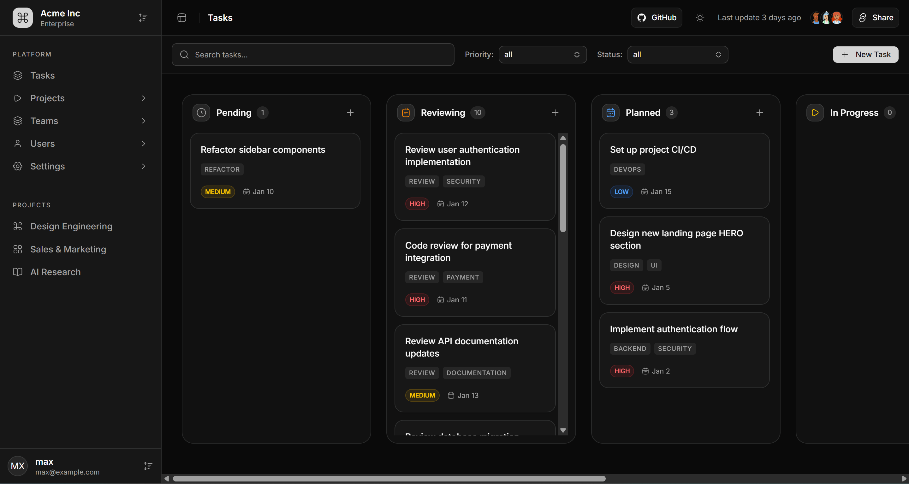

# Task Management Application

A modern, feature-rich task management application built with Next.js, featuring a Kanban board interface with drag-and-drop functionality, advanced filtering, and a beautiful UI.

https://task-management-chi-liard.vercel.app/

<div align="center">
  
</div>

## Features

- **Kanban Board**: Visual task management with drag-and-drop support across multiple columns
- **Task Management**: Create, edit, and organize tasks with priorities, labels, and due dates
- **Advanced Filtering**: Search tasks by title, filter by priority (Low, Medium, High), and filter by status
- **Dark/Light Theme**: Toggle between dark and light modes with system preference detection
- **Responsive Design**: Fully responsive interface with collapsible sidebar
- **Real-time Updates**: Smooth animations and transitions for a polished user experience
- **Task Priorities**: Visual priority indicators with color-coded badges
- **Labels System**: Organize tasks with custom labels
- **Status Tracking**: Track tasks across multiple stages (Pending, Reviewing, Planned, In Progress, Completed, Closed)

## Technologies

This project is built with the following technologies:

- **Framework**: [Next.js](https://nextjs.org) 16.1.1 (App Router)
- **UI Library**: React 19.2.3
- **Language**: TypeScript 5
- **Styling**: Tailwind CSS 4
- **UI Components**: [Base UI](https://base-ui.com) / [shadcn/ui](https://ui.shadcn.com)
- **Drag & Drop**: [@dnd-kit](https://dndkit.com) - Modern drag and drop toolkit
- **Icons**: [Hugeicons](https://hugeicons.com)
- **Notifications**: [Sonner](https://sonner.emilkowal.ski) - Toast notifications
- **Theming**: [next-themes](https://github.com/pacocoursey/next-themes) - Theme management
- **Utilities**: 
  - `class-variance-authority` - Component variants
  - `clsx` & `tailwind-merge` - Class name utilities

## Prerequisites

Before you begin, ensure you have the following installed:

- **Node.js** 18.0 or higher
- **pnpm** 8.0 or higher (recommended package manager)

If you don't have pnpm installed, you can install it globally:

```bash
npm install -g pnpm
```

## Installation

1. **Clone the repository** (if applicable) or navigate to the project directory:

```bash
cd templates/base-ui/task-management
```

2. **Install dependencies**:

```bash
pnpm install
```

3. **Start the development server**:

```bash
pnpm dev
```

4. **Open your browser** and navigate to [http://localhost:3000](http://localhost:3000)

The application will automatically reload when you make changes to the code.

## Available Scripts

- `pnpm dev` - Start the development server on [http://localhost:3000](http://localhost:3000)
- `pnpm build` - Create an optimized production build
- `pnpm start` - Start the production server (requires `pnpm build` first)
- `pnpm lint` - Run ESLint to check for code quality issues

## Project Structure

```
task-management/
├── app/                    # Next.js App Router directory
│   ├── layout.tsx         # Root layout with theme provider
│   ├── page.tsx           # Main tasks page with Kanban board
│   └── globals.css        # Global styles and Tailwind imports
├── components/            # React components
│   ├── ui/               # Reusable UI components (shadcn/ui style)
│   │   ├── button.tsx
│   │   ├── card.tsx
│   │   ├── dialog.tsx
│   │   ├── sidebar.tsx
│   │   └── ...           # Other UI components
│   ├── app-sidebar.tsx   # Main application sidebar
│   ├── main-content.tsx  # Main content component
│   └── theme-provider.tsx # Theme context provider
├── lib/                  # Utility functions
│   └── utils.ts         # Utility functions (cn helper, etc.)
├── public/              # Static assets
├── components.json      # shadcn/ui configuration
├── package.json        # Dependencies and scripts
├── tsconfig.json       # TypeScript configuration
└── tailwind.config     # Tailwind CSS configuration (via CSS)
```

## Usage

### Creating a Task

1. Click the **"New Task"** button in the top filter bar, or click the **"+"** icon in any column header
2. Fill in the task details:
   - **Title** (required)
   - **Description** (optional)
   - **Priority** (Low, Medium, High)
   - **Status** (select the initial column)
   - **Labels** (comma-separated, e.g., "Design, UI, Frontend")
3. Click **"Create Task"** to add the task

### Managing Tasks

- **Drag and Drop**: Click and hold a task card, then drag it to another column to change its status
- **Filter Tasks**: Use the search bar and filters in the top bar to find specific tasks
- **View Details**: Task cards display priority, labels, and due dates at a glance

### Filtering

- **Search**: Type in the search bar to filter tasks by title
- **Priority Filter**: Select a priority level (All, High, Medium, Low) from the dropdown
- **Status Filter**: Select a status/column to show only tasks in that column
- **Clear Filters**: Click the "Clear" button to reset all filters

### Theme Toggle

Click the sun/moon icon in the top-right corner to toggle between light and dark themes. The theme preference is saved and persists across sessions.

## Customization

### Modifying Columns

To add, remove, or modify Kanban columns, edit the `initialColumns` array in `app/page.tsx`:

```typescript
const initialColumns: Column[] = [
    { id: 'pending', title: 'Pending' },
    { id: 'reviewing', title: 'Reviewing' },
    // Add your custom columns here
]
```

### Customizing Themes

Theme colors are defined in `app/globals.css` using CSS variables. You can customize the color scheme by modifying the `:root` and `.dark` selectors.

### UI Components

This project uses shadcn/ui style components. You can add new components using:

```bash
npx shadcn@latest add [component-name]
```

Component configuration is stored in `components.json`.

## Deployment

### Deploy on Vercel

The easiest way to deploy this Next.js application is using [Vercel](https://vercel.com):

1. Push your code to a Git repository (GitHub, GitLab, or Bitbucket)
2. Import your project on [Vercel](https://vercel.com/new)
3. Vercel will automatically detect Next.js and configure the build settings
4. Click "Deploy" and your app will be live

For more details, see the [Next.js deployment documentation](https://nextjs.org/docs/app/building-your-application/deploying).

### Other Deployment Options

This application can be deployed to any platform that supports Next.js:

- **Netlify**: Connect your Git repository and configure the build command as `pnpm build`
- **Railway**: Deploy directly from GitHub with automatic detection
- **Docker**: Create a Dockerfile and deploy to any container platform

## Learn More

- [Next.js Documentation](https://nextjs.org/docs) - Learn about Next.js features and API
- [React Documentation](https://react.dev) - Learn React
- [Tailwind CSS Documentation](https://tailwindcss.com/docs) - Learn Tailwind CSS
- [shadcn/ui Documentation](https://ui.shadcn.com) - Learn about the UI components
- [dnd-kit Documentation](https://docs.dndkit.com) - Learn about drag and drop

## License

This project is part of a template collection. Please refer to the main repository for license information.
